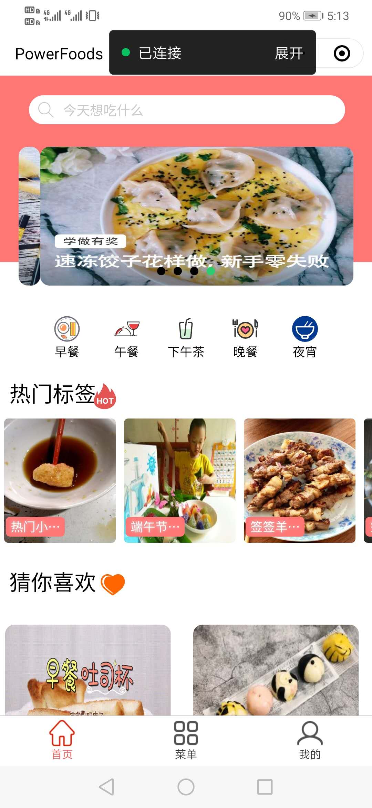
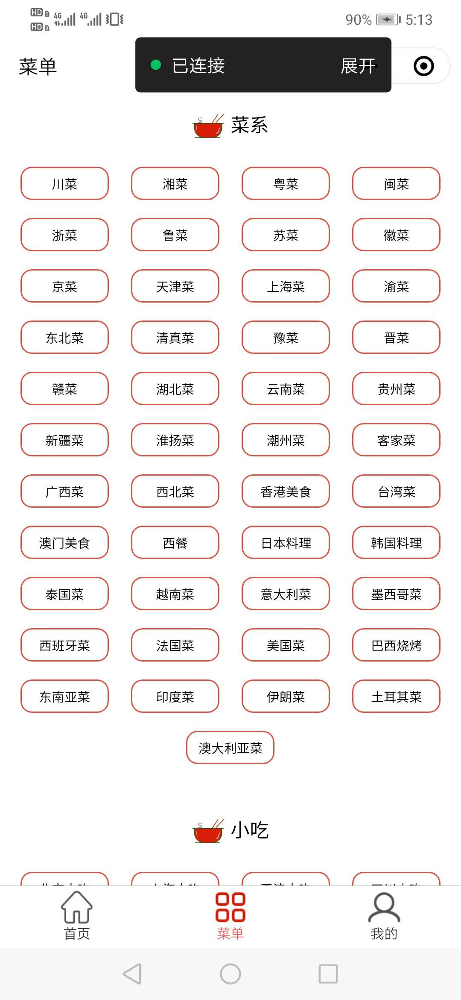
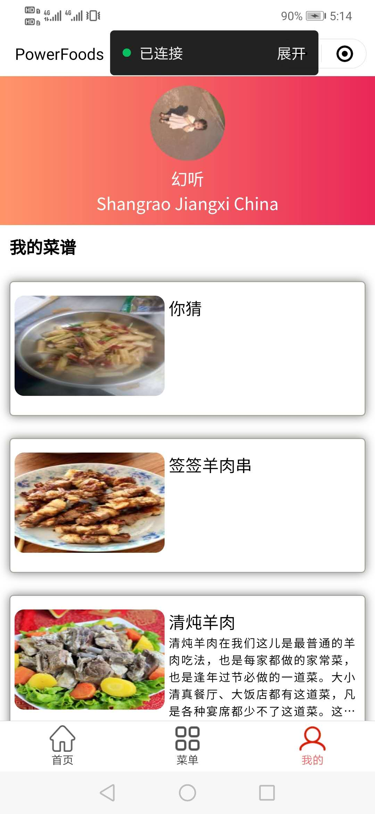
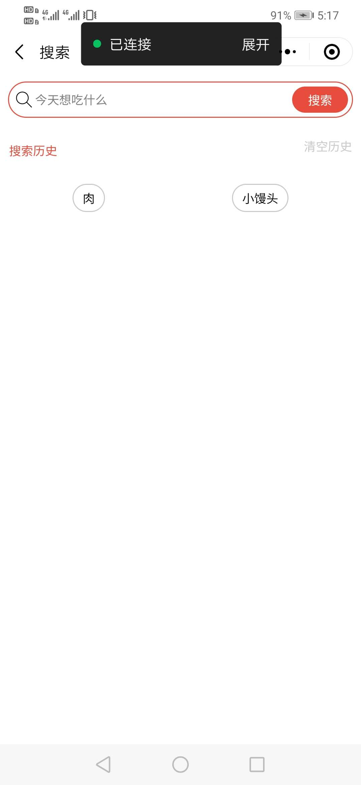
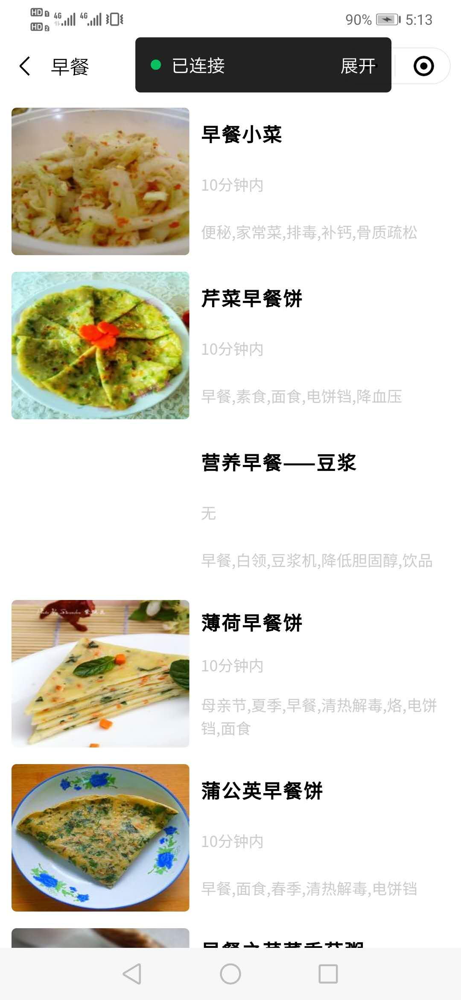
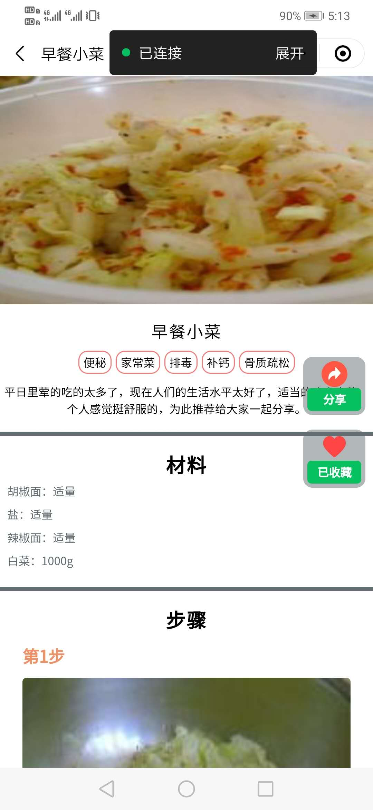

### 页面：

+ 首页        index
+ 菜单页      menus
+ 我的页面   mine
+ 搜索页面   search
+ 早餐午餐下午茶等菜谱页面  food_menu 
+ 菜单页面的菜谱页面 menu_detail 
+ 菜详情页面   food_detail

### 技术栈

+ 微信小程序原生
+ less语法
+ ES6语法
+ Iconfont字体图标库

### 收获
  + 通过一个简单的小程序来基本的了解微信小程序的相关组件和API的知识
  + 了解微信小程序项目开发的基本流程
  + 为后面微信小程序云开发的了解和使用奠定一定的基础

### 页面效果



### 记录一下有用的方法和踩过的坑
*1.在微信小程序中使用less语法*
+ https://zhuanlan.zhihu.com/p/64928515

*2.轮播图图片滑动的时候会先变成直角然后变成圆角问题*
+ 在 swiper 标签添加 两条属性
  + overflow: hidden;
  + transform: translateY(0);

*3.使用Iconfont 多彩图标的话 参考这篇文章*
+ https://blog.csdn.net/qq_42001842/article/details/103959394
+ 如果使用是单色的图标可以另外引入 样式文件

*4.微信小程序scroll-view左右横向滑动遇到的小细节*
+ https://blog.csdn.net/qq_36742720/article/details/84774738

*5.真机调试的时候 scroll-view 滚动的时候出现滚动条 隐藏的方法*
```css
  /* 复制到样式文件里 */
  ::-webkit-scrollbar{
    width: 0;
    height: 0;
    color: transparent;
  }
```

*6.解决 wx:if else 引起的 先显示后隐藏的问题（内容闪烁问题）*
 + 解决方案：先用一个变量让其隐藏，当从接口中获得数据的时候，在把这个 show 设置成 true 。这样出来的效果就是，内容逐渐在显示，依次显示。从而看不到闪烁再隐藏。
```js
  data: {
    // 用来判断
    show: false
  }
  // 当没有菜品信息的适合 让它显示
  else {
    console.log('菜谱审核中')
    wx.hideLoading()
    this.setData({
      show: true
    })
  }
  // 在wxml 中
  <view class="name" wx:if="{{!foodDetailData.name && show}}">抱歉，未找到相关菜品的信息</view>
```

*7.关于用户登录的相关知识*
+ 用户登录信息 通过本地缓存来存储用户相关信息
```js
// 点击登录按钮 获取用户信息 bindgetuserinfo="getUserInfo"  open-type="getUserInfo" 使用
  getUserInfo(e) {
    console.log(e)
    // 获取到用户信息
    const userInfo = e.detail.userInfo
    const msg = e.detail.errMsg
    // 判断 用户是拒绝授权 还是 同意授权
    if(msg == 'getUserInfo:fail auth deny') {
      // 拒绝授权的情况下
      // 提示用户 授权失败
      wx.showToast({
        title: '您拒绝了授权',
        icon: 'none',
        duration: 2000,
        mask: true
      })
    } else if(msg == "getUserInfo:ok"){
      // 同意授权的情况下
      // 下一步 把信息存入本地缓存中
      const info = wx.getStorageSync('userInfo')
      if(!info) {
        // 如果本地缓存中 没有 用户信息 将获取到的最新用户信息存入本地缓存中
        wx.setStorageSync('userInfo', {time:Date.now(), userInfo})
        // 并且 显示登录后的样式
        this.setData({
          show: true,
          info: wx.getStorageSync('userInfo')
        })
      }
    }
},

onShow: function () {
    // 当本地缓存被清空时 用户信息失去 用户需要重新登录
    // 当本地缓存有用户信息 时 则显示登录时的样式
    const info = wx.getStorageSync('userInfo')
    if(!info) {
      // 页面显示 未登录的样式
      this.setData({
        show: false
      })
    } else {
      // 页面显示登录的样式
      this.setData({
        show: true
      })
      // 获取 用户登录的信息 info  并且将信息渲染再页面上
      this.setData({
        info
      })
    }
}
```

*8.点击分享功能转发小程序*
```html
<!-- 点击分享按钮 时 转发小程序 share	触发用户转发 -->
<button class="title" size="mini" type="primary" open-type="share" bindtap="goShare">分享</button>
```

*9.点击收藏切换到已收藏时修改data数据中的对象的值方法*
```html
<!-- 收藏 和 已收藏 通过一个变量控制显示和隐藏 点击时就要改变变量的值 true 或 false -->
<button class="title" size="mini" type="primary" wx:if="{{!foodDetailData.ifCollect}}" bindtap="goCollect">收藏</button>
<button class="title" size="mini" type="primary" wx:if="{{foodDetailData.ifCollect}}" bindtap="goCollect">已收藏</button>
```
```js
goCollect() {
  // 改变 foodDetailData.inCollect 的值 时 收藏 和 已收藏 来回切换
  let collect = 'foodDetailData.ifCollect'
  this.setData({
    [collect]: !this.data.foodDetailData.ifCollect
  })
},
```
+ 要改变 foodDetailData 对象 中的其中一个属性的值 可以通过这种方式
+ https://blog.csdn.net/qq_39702981/article/details/86150700?depth_1-utm_source=distribute.pc_relevant.none-task-blog-OPENSEARCH-1&utm_source=distribute.pc_relevant.none-task-blog-OPENSEARCH-1
  

*10.用户收藏的数据使用本地缓存*
```js
goCollect() {
  // 改变 foodDetailData.inCollect 的值 时 收藏 和 已收藏 来回切换
  let collect = 'foodDetailData.ifCollect'
  this.setData({
    [collect]: !this.data.foodDetailData.ifCollect
  })
  if(this.data.foodDetailData.ifCollect) {
    wx.showToast({
      title: '已收藏',
      icon: 'success',
      duration: 500
    })
    // 将需要收藏的数据 foodDetailData 保存到本地缓存中
    const foodDetail = wx.getStorageSync('foodDetail')
    if(!foodDetail) {
      let foodDetail = []
      foodDetail.push(this.data.foodDetailData)
      wx.setStorageSync('foodDetail', foodDetail)
    } else {
      foodDetail.push(this.data.foodDetailData)
      wx.setStorageSync('foodDetail', foodDetail)
    }
  } else if(!this.data.foodDetailData.ifCollect) {
    wx.showToast({
      title: '取消收藏',
      duration: 500
    })
    const foodDetail = wx.getStorageSync('foodDetail')
    foodDetail.map((item,index) => {
      if(item.id == this.data.foodDetailData.id) {
        foodDetail.splice(index,1)
      }
    })
    wx.setStorageSync('foodDetail', foodDetail)
  }
},
// 判断 该 菜品再本地缓存中是否收藏
getLocalCollect() {
  const foodDetail = wx.getStorageSync('foodDetail')
  if(!foodDetail) {
    return
  } else {
    // 菜谱id
    const id = this.data.foodDetailData.id
    console.log(id)
    for(let item of foodDetail) {
      if(item.id === id) {
        // 改变 foodDetailData.inCollect 的值 时 收藏 和 已收藏 来回切换
        let collect = 'foodDetailData.ifCollect'
        this.setData({
          [collect]: true
        })
      }
    }
  }
},
```